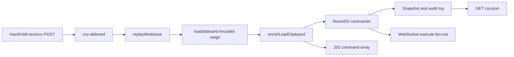

# Multi-sheet TOC CSV POST Fix Design

## Problem

The multi-sheet client initializes and appends table-of-contents rows by sending `POST /_/:room` with `Content-Type: text/csv`. The Worker currently classifies every non-JSON, non-XLSX/ODS body as a literal SocialCalc command, so raw CSV reaches `RoomDO` as invalid commands. The route still returns `202`, but `GET /_/:room/csv.json` remains empty and a fresh `/=:room` renders no sheet tabs.

The pinned legacy implementation at commit `042b731d9e98f1d30537e6cb656f65792afdecdf` treats unmatched formats through its SheetJS-based `J` decoder. For CSV it creates a bare `loadclipboard <encoded-save>` command. The existing POST handler then appends `paste A2 all` for a cold room, `paste A<lastrow+1> all` for an existing sheet, or `insertrow` plus `paste` when `?row=N` is supplied. Its `202` response echoes the enriched command array, which `HackFoldr` reads to recover the persisted row number.

## Compatibility Contract

`POST /_/:room` with `Content-Type: text/csv` must:

1. Parse CSV through the same SheetJS replay pipeline used by binary workbook imports, preserving legacy number and date coercion.
2. Convert the imported first sheet to one encoded `loadclipboard` command.
3. Reuse the existing `enrichLoadClipboard()` logic:
   - no stored sheet dimension: paste at `A2`;
   - stored `lastrow=N`: paste at `A<N+1>`;
   - truthy `?row=N`: insert and paste at `A<N>`.
4. Dispatch the newline-joined command batch to `POST /_do/commands`, preserving RoomDO storage and WebSocket fan-out behavior.
5. Return `202 application/json` with `{command: [loadclipboardCommand, pasteCommand]}` (or the three-command `?row` form).
6. Append to existing room data; it must never replace the snapshot.

Zero-byte CSV remains the existing `400 Please send command` behavior. An empty parsed worksheet returns `202 {command: []}` without a DO dispatch. Oversized CSV uses the existing import cell limit and returns `413`. Malformed, non-empty CSV that SheetJS cannot import returns `400 Could not import CSV`.

## Architecture

### Body classification

Extend `ClassifiedCommand` in `packages/worker/src/handlers/post-command.ts` with a `csv-deferred` kind. `classifyCommandBody()` recognizes `text/csv` after normalizing content-type parameters and returns `csv-deferred` for non-empty bytes. JSON, plain-text, SocialCalc, XLSX, and ODS branches remain unchanged.

### Shared workbook-to-clipboard conversion

Refactor `packages/worker/src/lib/xlsx-import.ts` to expose a format-neutral helper:

```ts
workbookToLoadClipboardCommand(bytes: Uint8Array): string | null
```

The helper uses the existing `replayWorkbook()` path, cell-count/archive guards, SocialCalc range save, and `encodeForSave()`. It returns `null` when no populated cells exist. `xlsxToLoadClipboardCommands()` delegates to this helper and retains its exact current result: `[]` for an empty workbook or `[loadclipboardCommand, 'paste A1 all']` otherwise.

### Room route normalization

In `packages/worker/src/routes/rooms.ts`, the XLSX/ODS branch remains an early-return path. A `csv-deferred` body is converted with `workbookToLoadClipboardCommand()` and normalized to the same internal `text-command` shape used by literal `loadclipboard` requests. The existing text-wiki, multi-cascade, loadclipboard-enrichment, cron parsing, DO dispatch, and response code then runs without a parallel CSV-specific implementation.

## Data Flow



## Testing

### Unit tests

- `post-command.node.test.ts`: `text/csv` and `text/csv; charset=utf-8` classify as `csv-deferred`; empty CSV remains `empty`.
- `xlsx-import.node.test.ts`: the shared helper creates a loadclipboard command for CSV bytes, preserves typed cells when pasted, returns `null` for an empty sheet, and leaves existing XLSX helper output unchanged.

### Route and Durable Object tests

- `routes-rooms-post.node.test.ts`: CSV POST returns the enriched array, reads the current snapshot for row derivation, and dispatches the joined loadclipboard/paste batch rather than raw CSV.
- A workers-pool route test uses the real `RoomDO`: seed an existing cell, POST TOC CSV, then assert `GET /_/:room/csv.json` contains the original row followed by the TOC rows. A cold-room case pins the `A2` fallback.

### Oracle parity

Add ordered oracle scenarios against the pinned legacy container:

1. POST deterministic TOC CSV to a never-touched room — pins the cold-room
   `paste A2 all` fallback (status 202, body ignored).
2. POST deterministic TOC CSV to the existing phase-3 export room, then GET
   its `csv.json` representation to pin `lastrow + 1` append behavior.
3. Delete the cold oracle room during teardown.

The POST fixtures assert status and content type while ignoring encoded
command-body differences between SocialCalc versions. The seeded-room
follow-up structural JSON fixture proves both row placement and persisted
legacy-equivalent state.

**Cold-room divergence (decision #1):** Legacy Redis never persists a
truly cold room's paste — `GET /_/:room/csv.json` returns 404. The worker's
Durable Object materializes a snapshot from the paste command, so it
returns 200 with the TOC grid. This is a sensible-fix divergence: the
cold-room POST fixture pins the 202 + `paste A2 all` command, but no
cold-room GET fixture is recorded (it would fail worker replay forever).
The workers-pool test is the sole pin for the cold-room persisted grid.

### Browser smoke

Against a local Worker, open a fresh `/=:room` and verify:

- `Sheet1` appears;
- reload preserves the tab;
- adding a sheet returns the correct server row;
- rename and delete persist without duplicate or ghost tabs;
- no page or console errors occur.

## Non-goals

- No `client-multi` protocol change.
- No change to `PUT text/csv`, which replaces a room snapshot.
- No change to XLSX/ODS POST placement at `A1`.
- No broad change to other unmatched content types.
- No cleanup of the legacy duplicate-seed behavior already handled by TOC deduplication.
