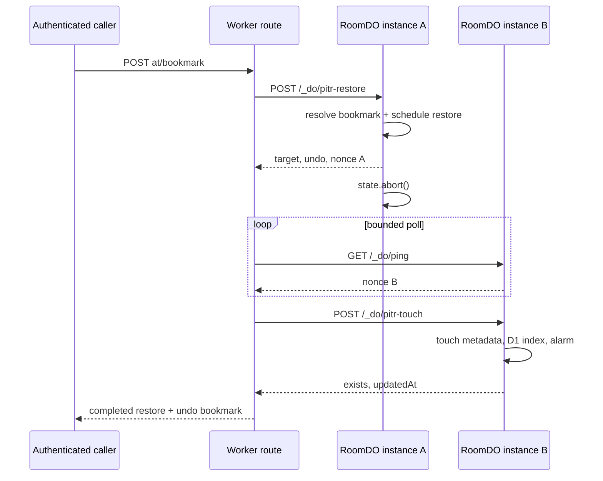

# Hosted Room Point-in-Time Restore Design

## Problem

EtherCalc’s Cloudflare-hosted `RoomDO` class is SQLite-backed, so Cloudflare already retains a continuous point-in-time recovery (PITR) history for the complete Durable Object database. That history includes the SocialCalc snapshot plus the KV-backed command, audit, chat, ecell, metadata, and alarm state. The current application has no route that resolves or applies PITR bookmarks, so deletion through `DELETE /_/:room`, TTL expiry, accidental overwrite, and vandalism cannot be recovered through EtherCalc even while Cloudflare still holds the history.

The legacy `https://ethercalc.net/log/<room>` application was a separate hosted service rather than code in this repository. Recreating hourly dumps and its viewer is outside this first tier. The smallest high-value feature is a capability-authenticated restore API for operators and recovery tooling.

Cloudflare documents that SQLite-backed Durable Objects can restore their entire embedded database to a bookmark from approximately the previous 30 days. `getBookmarkForTime()` resolves a time, `onNextSessionRestoreBookmark()` schedules the restore and returns an undo bookmark, and `DurableObjectState.abort()` restarts the instance to apply it. PITR is explicitly unavailable in local development and standalone workerd.

## Compatibility and Security Contract

Add this public route:

```text
POST /_/:room/pitr-restore?auth=<room capability>
Content-Type: application/json
```

It uses the exact authentication rule already applied to `DELETE /_/:room`:

- with `ETHERCALC_KEY`, `auth` must be the room-name HMAC;
- `auth=0` is always rejected;
- without `ETHERCALC_KEY`, EtherCalc’s documented anonymous mode remains open.

Authentication runs before body parsing or any Durable Object request. A failed check returns `403 Forbidden` and reveals no bookmark or room state.

The JSON body must contain exactly one target:

```json
{ "at": "2026-07-10T00:00:00.000Z", "dryRun": true }
```

```json
{ "at": 1783641600000 }
```

```json
{ "bookmark": "0000007b-..." }
```

`at` accepts a positive, finite millisecond epoch or a parseable ISO-8601 string and is normalized to a millisecond epoch. `bookmark` must be a non-empty string. `dryRun` is optional and must be boolean; it defaults to `false`. Unknown JSON properties are ignored. Malformed JSON and invalid shapes return `400` before recovery is attempted.

The route is intentionally unavailable on deployments whose storage runtime lacks PITR. Self-hosted workerd and local Miniflare return `501 PITR is unavailable on this deployment`; volume/file snapshots remain the supported self-host recovery mechanism.

## Public Responses

A dry run resolves the target without scheduling a restart:

```json
{
  "dryRun": true,
  "bookmark": "0000007b-..."
}
```

A completed restore returns only after a new Durable Object instance is observed and post-restore bookkeeping succeeds:

```json
{
  "restored": true,
  "bookmark": "0000007b-...",
  "undoBookmark": "0000007c-...",
  "exists": true,
  "updatedAt": 1783641660000
}
```

The `undoBookmark` is Cloudflare’s pre-recovery bookmark. Supplying it in a later restore reverses the recovery while it remains inside the platform retention window. If the selected bookmark predates room creation, `exists` is `false` and `updatedAt` is omitted.

Platform rejection of an unavailable time or invalid/expired bookmark returns `400` without scheduling a restore. A missing PITR capability returns `501`. An internal DO dispatch failure returns `502`. If the instance does not restart within the bounded polling window, return `500` rather than claiming the restore completed.

## Architecture

### Pure request and capability logic

Create `packages/worker/src/lib/pitr.ts` with:

```ts
parsePitrRequest(body: unknown): PitrParseResult
bookmarkStorage(storage: unknown): PitrStorage | null
```

The parser owns all public request normalization. `bookmarkStorage` performs runtime feature detection for `getBookmarkForTime()` and `onNextSessionRestoreBookmark()` so the same bundle degrades deterministically on local and self-hosted runtimes.

### Durable Object protocol

Each `RoomDO` instance receives a cryptographically random, in-memory nonce at construction. `GET /_do/ping` adds this nonce to its existing `{id, name}` response. The value is stable for one instance and changes after `state.abort()` constructs the replacement instance.

`POST /_do/pitr-restore` repeats request validation at the trust boundary, checks storage capability, resolves `at` through `getBookmarkForTime()` or uses the supplied bookmark, and supports two paths:

1. `dryRun: true`: return the resolved bookmark without changing storage.
2. restore: call `onNextSessionRestoreBookmark(bookmark)`, capture its undo bookmark, return the accepted target plus the current instance nonce, and schedule `state.abort()` after the response has had time to cross the DO boundary.

The delayed abort is self-healing: recovery is still applied even if the outer Worker disconnects after the DO accepted it. No module-global mutable state is used.

`POST /_do/pitr-touch` runs only in the replacement instance. It checks for either the single-key or chunked snapshot layout. For an existing room it updates only `meta:updated_at`, re-mirrors the D1 `rooms` row, and re-arms the housekeeping alarm. Spreadsheet cells, command history, audit history, chat, and ecell values remain exactly as restored. For an empty restore it leaves storage empty and does not recreate a D1 row or alarm.

### Worker orchestration

The public route dispatches the normalized request to `/_do/pitr-restore`.

- Dry runs pass the resolved bookmark back immediately.
- Accepted restores poll `/_do/ping` until its nonce differs from the accepting instance’s nonce.
- Once the replacement instance is visible, the route calls `/_do/pitr-touch` and returns the combined public response.

Polling is bounded and catches transient connection failures caused by the intentional abort. The nonce avoids mistaking a still-live old instance for successful recovery.



## Concurrency and Failure Semantics

`onNextSessionRestoreBookmark()` is awaited before the abort is scheduled. The old instance does no other storage work after accepting recovery. The new instance performs finalization, so cached spreadsheet state and sequence counters cannot leak across the restored timeline.

A retry by the caller is safe when it uses the same target bookmark: the platform schedules that target again and returns a new undo point. The API does not claim exactly-once request semantics. Operators must retain the returned undo bookmark outside the restored room because restoring the room also rewinds all of its own storage.

The D1 room index is derived metadata, not the recovery source. The touch endpoint repairs its row after restoration. Existing D1 audit/chat archive rows are not deleted: they remain an append-only forensic record beyond the restored RoomDO state.

## Testing

### Node unit coverage

- Parser: every accepted target form, exact-one-of enforcement, timestamp validity, bookmark validity, and `dryRun` typing.
- Capability detection: both methods required; null, primitives, and partial method sets rejected.
- RoomDO: stable/different nonce behavior; missing capability; target resolution; dry run; platform errors; accepted restore and delayed abort; empty/existing touch; D1 re-mirror and alarm re-arm.
- Worker route: auth-before-parse, malformed and invalid JSON, dry run, accepted restore, transient ping failures, timeout, DO errors, and touch response composition.

### Workers-pool behavior

A real workerd test calls the internal dry-run endpoint. The expected local contract is `501`, pinning Cloudflare’s documented “PITR is not supported in local development” behavior without faking recovery.

### Hosted smoke

Deploy to staging and use a unique scratch room:

1. write known content and capture a bookmark;
2. overwrite or delete the room;
3. restore the captured bookmark;
4. verify byte-for-byte room content, D1 index visibility, and an armed alarm;
5. restore the returned undo bookmark and verify the overwrite/deletion returns;
6. delete all scratch rooms and remove any temporary probe code.

Production gets a non-destructive dry run and, if a temporary scratch room is used, the same restore/undo cycle followed by deletion.

## Non-goals

- No user-facing backup browser or `/log/<room>` clone.
- No hourly R2 snapshot job, backup retention setting, or R2 binding.
- No workbook-wide multi-room restore; each sheet room is recovered independently.
- No D1 Time Travel orchestration.
- No PITR emulation for standalone workerd or Miniflare.
- No public bookmark-list endpoint; callers resolve a timestamp with `dryRun`.
- No release-version bump solely for this hosted operational endpoint.
